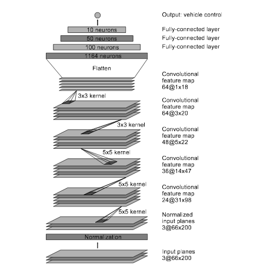
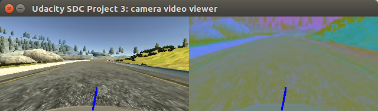

/ SDC-P3
Udacity Self-Driving Car Project 3: Behavioral Cloning

Use Behavioral Cloning to train a CNN model to drive a car in a simulator.

## 1. Network Structure

Our final CNN is based on NVIDIA's CNN - Paper:  https://arxiv.org/pdf/1604.07316v1.pdf.  Before finalizing on this architecture, we experimented with a model from the Keras lab, and Comma.ai's model from: https://github.com/commaai/research.  The problem with both of these models is that they have too many model parameters and the hidden layers weights are much too large to be scalable.  The following table shows the size of the weights from save h5 files:

| Model | File | Size (Bytes) | Description |
|:---:|:---|---:|:---|
| 1 | model1.h5 | 374997240 | Best performing Keras lab model |
| 2 | model2.h5 | 2901288 | Comma.ai model, without Lamda layer |
| 3 | model3.h5 | 26506536 | Comma.ai model, with Lamda layer |
| 4 | model4.h5 | 620080 | NVIDIA model with Lamda layer |
| 5 | model5.h5 | 620080 | NVIDIA model with Lamda layer - side cameras + YUV |
| 6 | model6.h5 | 620080 | NVIDIA model with Lamda layer - track2 |
| 7 | model7.h5 | 620080 | NVIDIA model with Lamda layer - track1, 1/3 top cropped, and dropouts |
| 8 | model8.h5 | 620080 | NVIDIA model with Lamda layer - agile trainer |
| F | model.h5 | 620080 | NVIDIA model with Lamda layer - final |

As can be seen, the NVIDIA based model weights are a lot smaller; and therefore, much more scalable and performs faster.  We pretty much followed the CNN network architecture from NVIDIA as outlined in their paper.  Our CNN consists of 10 layers, including an additional maxpool layer to even further reduce the number of parameters.  The layers includes a Lamda normalization layer, 5 convolutional layers and 3 fully connected layers with dropouts:

| Layer (type) | Output Shape | Param # | Connected to |
| :--- | :--- | ---: | :--- |
| maxpooling2d_1 (MaxPooling2D) | (None, 33, 66, 3) | 0 | maxpooling2d_input_1[0][0] |
| lambda_1 (Lambda) | (None, 33, 66, 3)| 0 | maxpooling2d_1[0][0] |
| convolution2d_1 (Convolution2D) | (None, 9, 17, 5)| 1805 | lambda_1[0][0] |
| elu_1 (ELU) | (None, 9, 17, 5) | 0 | convolution2d_1[0][0] |
| convolution2d_2 (Convolution2D) |(None, 5, 9, 5) | 4505 | elu_1[0][0] |
| elu_2 (ELU) |(None, 5, 9, 5) | 0 | convolution2d_2[0][0] |
| convolution2d_3 (Convolution2D) |(None, 3, 5, 5) | 6005 | elu_2[0][0] |
| elu_3 (ELU) |(None, 3, 5, 5) | 0 | convolution2d_3[0][0] |
| convolution2d_4 (Convolution2D) |(None, 2, 3, 3) | 2883 | elu_3[0][0] |
| elu_4 (ELU) |(None, 2, 3, 3) | 0 | convolution2d_4[0][0] |
| convolution2d_5 (Convolution2D) |(None, 1, 2, 3) | 1731 | elu_4[0][0] |
| flatten_1 (Flatten) | (None, 6) | 0 | convolution2d_5[0][0] |
| dropout_1 (Dropout) | (None, 6) | 0 | flatten_1[0][0] |
| elu_5 (ELU) | (None, 6) | 0 | dropout_1[0][0] |
| dense_1 (Dense) | (None, 1164) | 8148 | elu_5[0][0] |
| dropout_2 (Dropout) | (None, 1164) | 0 | dense_1[0][0] |
| elu_6 (ELU) | (None, 1164) | 0 | dropout_2[0][0] |
| dense_2 (Dense) | (None, 100) | 116500 | elu_6[0][0] |
| dropout_3 (Dropout) | (None, 100) | 0 | dense_2[0][0] |
| elu_7 (ELU) | (None, 100) | 0 | dropout_3[0][0] |
| dense_3 (Dense) | (None, 50) | 5050 | elu_7[0][0] |
| dropout_4 (Dropout) | (None, 50) | 0 | dense_3[0][0] |
| elu_8 (ELU) | (None, 50) | 0 | dropout_4[0][0] |
| dense_4 (Dense) | (None, 10) | 510 | elu_8[0][0] |
| dropout_5 (Dropout) | (None, 10) | 0 | dense_4[0][0] |
| elu_9 (ELU) | (None, 10) | 0 | dropout_5[0][0] |
| dense_5 (Dense) | (None, 1) | 11 | elu_9[0][0] |

Total params: 147148



More details of this architecture can be obtained in the NVIDIA paper as referenced earlier.  In the final architecture, we also included additional pre-processing steps.  These are:

- 1.  Resize the image from 320x160 to 200x66.
- 2.  Convert the 200x66 image from RGB to YUV.
- 3.  Crop the first 22 rows from the top so the image is now 200x44 and then resize it back to 200x66.



And these steps are also included in the new drive.py module.  We also increase the throttle from 0.2 to 0.5 in drive.py, so we may climb the steep hill in Track 2.

## 2. Training Approach

### 2a. Optimizer Selection
In the final architecture, we decided to use the Keras builtin support for the Adam optimizer as in our architecture in project 2.  The Adam optimizer, as explained in project 2, is Kingma and Ba's modified version of the Stochastic Gradient Descent that allows the use of larger step sizes without fine tuning.


It uses moving averages of the parameters (momentum) to achieve this, as discussed in section 3.1.1: https://arxiv.org/pdf/1206.5533.pdf.  In general, the Adam optimizer uses cross entropy calculations to minimize loss (average distance to the target label in the solution space) and use gradient descent, an iterative optimization technique and algorithm to achieve this goal.  Even though using the Adam optimizer should allow us to use larger step sizes (learning rates), we decided to restrict this hyper parameter to 0.00001.  This made it so that the model never seem to converge, so it never over-fit; however, in subsequent tests, the model performed exceptionally well in steering the car in the simulator and making sure that the car remaining in the center of the lane.  

### 2b. Simulator Training Input
We first started out with driving the simulator using keyboard, but that was unsatisfactory.  The controls were jerky and resulted in poor data collection, since it was a digit input device (off|on).  We obtained a Sony PS3 controller and found that the Unity simulator was able to respond correctly to this input device using the xboxdrv.  We include the PS3Controller.sh that we used to initialize the device for connecting to the simulator in the training-tools directory in the repository.  The new controller's analog to digital input gave us a floating point input which made the steering much smoother.


### 2c. Driving Both Counter Clockwise and Clockwise around Track1
The training data were initially collected using the simulator for track 1 only in the forward direction (counter clockwise) for about 10 times.  However, during testing in Autonomous mode, we found that the CNN had a tendency of moving to the left, so we ran Track1 again 10 times in the reverse (clockwise) direction.  This is so we could make balance the left steering tendency with a set of right turn steers by going in the opposite direction.

### 2d. Training Set Data:
The training set data collected include two sets of files.  A CSV that contained the file path to the current center, right and left camara images, as well as, the current throttle, brake, speed and steering information.  The trainer, instead of reading the entire dataset into memory, used the model.fit_generator function in Keras to bring in just one image at a time to feed the Titan X pascal GPU that we use for the training and validation.  Below are some samples of the data in the CSV and images from the left, center and right camaras.

#### - CSV File
```
center,left,right,steering,throttle,brake,speed
...
/home/jchen/SDCND/BehaviorCloning/drivingDataTrack1/IMG/center_2016_12_01_13_31_14_194.jpg, /home/jchen/SDCND/BehaviorCloning/drivingDataTrack1/IMG/left_2016_12_01_13_31_14_194.jpg, /home/jchen/SDCND/BehaviorCloning/drivingDataTrack1/IMG/right_2016_12_01_13_31_14_194.jpg, 0, 0, 0, 1.279884
/home/jchen/SDCND/BehaviorCloning/drivingDataTrack1/IMG/center_2016_12_01_13_31_14_295.jpg, /home/jchen/SDCND/BehaviorCloning/drivingDataTrack1/IMG/left_2016_12_01_13_31_14_295.jpg, /home/jchen/SDCND/BehaviorCloning/drivingDataTrack1/IMG/right_2016_12_01_13_31_14_295.jpg, 0, 0, 0, 1.267316
/home/jchen/SDCND/BehaviorCloning/drivingDataTrack1/IMG/center_2016_12_01_13_31_14_398.jpg, /home/jchen/SDCND/BehaviorCloning/drivingDataTrack1/IMG/left_2016_12_01_13_31_14_398.jpg, /home/jchen/SDCND/BehaviorCloning/drivingDataTrack1/IMG/right_2016_12_01_13_31_14_398.jpg, 0, 0, 0, 1.254873
...
```

#### - Left Camera


#### - Center Camera


#### - Right Camera


As discussed earlier, these images if processed, will be converted to YUV and then resized to 200x66 and the top 22 rows cropped.


### 2e. Training/Validation Split
As always, in our training we split the training data into batch training and validation, and we did this up to model7.  But stopped when we started using the Continuous (Agile) Trainer, which will be explained in the next section.

### 2f. Continuous (Agile) Trainer
As we trained, we grew tired of having to batch and then train and rebatch as we found new issues with our training data, or missing data that we needed to train on.  This was very unsatisfactory, so we decided to try a different approach.  Barrowing from Agile development, we decided that the loop from model design, training and testing needs to be faster and more responsive, so we looked again at NVIDIA's paper for inspiration and we found this:


NVIDIA, it seems, created their own simulator using the data they recorded using human drivers.  Initially we use the same path as NVIDIA by generating jitter data using the different camera angles.  But that was still unsatisfactory since we were limited by the angle that the car was facing, so we still needed to collect new data as we find additional steering issues when testing in Autonomous mode.  We finally decided to try a prototype to interface directly with the drive.py.


And the trainer using pygame joystick interface as the input.  At first, we were unsuccessful, because we could not start up the socket and the model trainer at the same time; however, we finally tried the threading libraries in Python and were about to launch both the websockets and the Keras model trainer at the same time!  


The experiment/prototype was a success, and we were able to both drive via the joystick and train the model at the same time.  It was a turning point.


Once we did this, our training time sped up.  We were able to train the model to track the lane in the middle in just a single one hour active session using the Titan X pascal GPU.  While we were not activately training the model, the model was still training itself using already preprocessed cached queued data accessed randomly via the model.fit_generator.  Using this method, we were also able to assess if the training was working by running the Autonomous mode with assistance from our joystick input.  Doing this allowed us to see how well the model perform with minor corrections at key points.  Once we identified key points in the model's weakness, we ran the continuous training at those key points in slow motion with speeds of 0.1 or less to gather maximum datapoints for the model to correct itself.  Since we were using such a low learning rate of 0.00001, the model never overfit the data, so we were left with a very generalized model that works in different speeds.  We were very happy when the moment came and we were able to repeatedly run Track1 for hours on end.

<a href="http://www.youtube.com/watch?feature=player_embedded&v=RvTJHmYHiZE" target="_blank"></a>

We even try Track2 and it worked up to a certain point.

<a href="http://www.youtube.com/watch?feature=player_embedded&v=GFoUWijjJpA" target="_blank"></a>

### 2g.  Destructive Testing.
We even performed some destructive tests, where we interfaced with the test drive.py and test model with the pygame joystick module and delibrately steer the car off course by nudging the steering.  In most cases, the car reacted by steering back to the center.  Only in extreme cases, the car lost control and wonder off into the woods or into the lake.

### 2h.  Testing/Training Tools.
We built numerous testing and training tools as discussed in the previous sections.  They are included in the training-tools directory.  The tools are:

| Tool | Description | Usage |
| :--- | :--- | :--- |
| PS3Controller.sh | Shell script to launch PS3/XBOX controller driver | sudo ./PS3Controller.sh |
| pygamejoy.py | Inspiration script to interface with joystick using pygame: http://www.pygame.org/docs/ref/joystick.html | python pygamejoy.py |
| pygameJoyDriveInterface.py | Initial Prototype to interface pygame, drive.py and the model | python pygameJoyDriveInterface model.json |
| continuousTrainer.py | Continuous Trainer | python continuousTrainer.py model.json |


